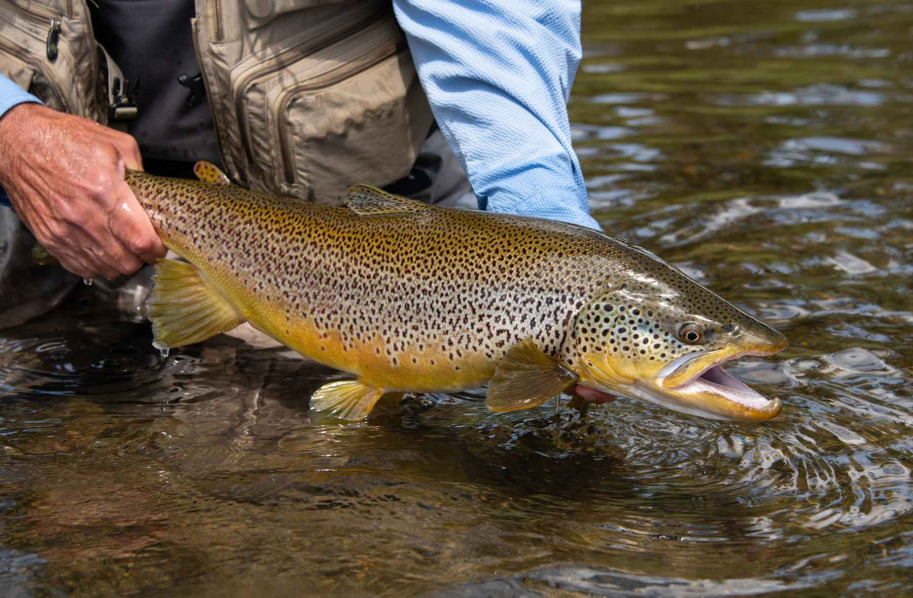
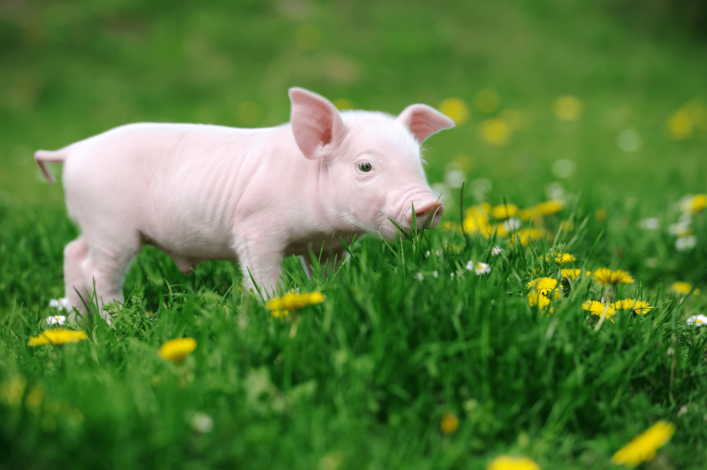

<body style = "background-color:#77ba6a">
<center><span style="font-size:25px">Example 1 - Repeated Measures Model</span></center>

$~$

```{r setup, include=FALSE}
knitr::opts_chunk$set(echo = TRUE)
packages_needed <- c("ggplot2", # graphics
                     "dplyr",
                     "arm", # display() etc.
                     "MASS",
                     "ggfortify",
                     "nlme",
                     "lme4",
                     "lmerTest",
                     "asbio",
                     "see",
                     "patchwork"
                     )
pk_to_install <- packages_needed [!( packages_needed %in% rownames(installed.packages())  )]
if(length(pk_to_install)>0 ){
  install.packages(pk_to_install,repos="http://cran.r-project.org")
}
#lapply(packages_needed, require, character.only = TRUE)
library(ggplot2)
library(dplyr)
library(arm)
library(MASS)
library(ggfortify)
library(nlme)
library(lme4)
library(lmerTest)
library(asbio) # Aho 2014 example data
library(janitor)
library(see)
library(patchwork)

```

<center> 

{width=50%} 

</center>

$~$


```{r Data}

trout_growth <- read.csv("data/HunderTroutData_Growth.csv")%>%na.omit(trout_growth)

trout_growth <- clean_names(trout_growth)
trout_growth$mark_no <- as.factor(trout_growth$mark_no)

trout_growth$smolting_status <- as.factor(trout_growth$smolting_status)

trout_growth$maturation_status <- as.factor(trout_growth$maturation_status)

trout_growth$spawn_status <- as.factor(trout_growth$spawn_status)

trout_growth$age_total <- as.factor(trout_growth$age_total)
```

$~$

<center><span style="font-size: 25px">Visualize the Data</span></center>

$~$

```{r Data Plot}
trout_sample <- trout_growth[1:178,]
p1<- ggplot(trout_sample, aes(x=age_total, y=length, group=mark_no, color=mark_no)) + 
  geom_line()+
  #geom_point(size=4, position = position_dodge2(width=.33, preserve = "total")) +
  labs(title="Trout Grow as They Age??", x= "Age", y = "Length (mm)")
p1
```
```{r fitsh Mixed Model}

trout_model <- lmer(length ~ age_total + (1|mark_no), data=trout_sample)
anova(trout_model)


```

```{r Trout Summary}

summary(trout_model)

```
$~$

<center><span style="font-size:25px">Example 2 - Hierarchical Model</span></center>

$~$

<center>Piggie, Piggie, Piggie, Can't You See?</center>

<center>

{width=40%}

</center>

$~$

<center>

{width=50%}

</center>

$~$

<center><span style="font-size: 25px">Visualize the Data</span></center>
```{r Pig Data}

pig_data <- read.csv("data/pig_data.csv")
pig_data <- clean_names(pig_data)
pig_data$id <- as.factor(pig_data$id)


```

```{r The Plot (and Pig) Thickens}

ggplot(pig_data, aes(i_treatment, average_daily_gain, colour = as.factor(id), shape=as.factor(day))) + 
  geom_jitter(width =0.15, size=5) +
  annotate("text", x = 2, y = 25, label = "30 piglets") +
  annotate("text", x = 2, y = 23, label = "5 measures per piglet") +
  annotate("text", x = 2, y = 21, label = "150 total measurements")
```

```{r Pig Model}

pig_model <- lmer(average_daily_gain ~ (i_treatment*day) + (1|id), data=pig_data)

pig_model

```
```{r Anova}
anova(pig_model)
```

```{r Summary}
summary(pig_model)
```
</body>
